# White Stone Android — Parity Changes Since Plan

Factual outline of changes made to the Android app after the iOS-parity plans were drafted.

> Drop the `screenshots/` directory next to this file when porting into a Hugo page bundle, or copy the images to `static/screenshots/` and adjust paths to `/screenshots/…`. All image references below use relative paths that work in both layouts.

- Parity plan baseline commit: `8661a70 Add Android parity plan for iOS v1.2 phases 1-4` (2026-05-16)
- Onboarding parity plan baseline: `ANDROID_ONBOARDING_PARITY_PLAN.md` (revised 2026-05-23)
- Outline written: 2026-05-23
- Screenshots captured on emulator `Pixel_5_API_33` (1080x2340) from the most recent debug build

---

## Commit timeline

| Commit | Date | Title |
|---|---|---|
| `1665eb4` | 2026-05-17 | phase-1-3: add review tab and stone tagging parity |
| `2607393` | 2026-05-17 | phase-2: add reflection tab parity |
| `01deaad` | 2026-05-17 | phase-4: add pattern observations |
| `9295c80` | 2026-05-23 | Implement onboarding parity flow |

Phase 5 (evening closure) remains deferred per the plan — it is not yet shipped on iOS.

---

## 1. Review tab consolidation (PR 1 — `1665eb4`)

The old `Calendar` and `Trends` tabs were collapsed into a single `Review` tab. The bottom navigation went from `Today / Calendar / Trends / About` to `Today / Review / Reflections / About`.

Changed files of note:
- Removed: `ui/calendar/CalendarScreen.kt`, `ui/calendar/CalendarViewModel.kt`, `ui/trends/TrendsScreen.kt`
- Added: `ui/review/ReviewScreen.kt`, `ui/review/ReviewViewModel.kt`
- `ui/navigation/Screen.kt` — `Calendar` and `Trends` removed, `Review` and `Reflections` added
- `ui/navigation/WhiteStoneNavGraph.kt` — bottom nav reordered

Layout of the Review tab (top to bottom):

1. **Stat strip** — total days tracked, this-month tally, streak counter (moved verbatim from the old Trends tab — same numeric value, same logic).
2. **Segmented control** — `14 days` / `All-time` / `Patterns`.
3. **Calendar** — month grid, prev/next month navigation, ratio-coloured cells, tap to select.
4. **Selected-day stones** — timeline list under the calendar.

### Screenshots

Review summary + segmented control:

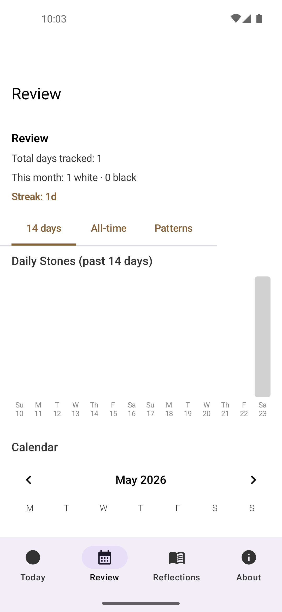

Calendar with selected day, stones list (showing new tag summary), and reflection card:

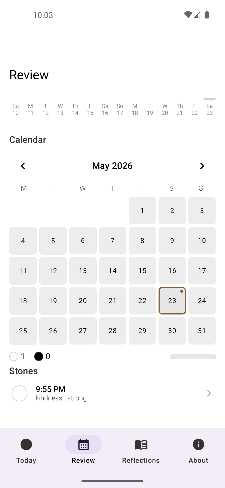

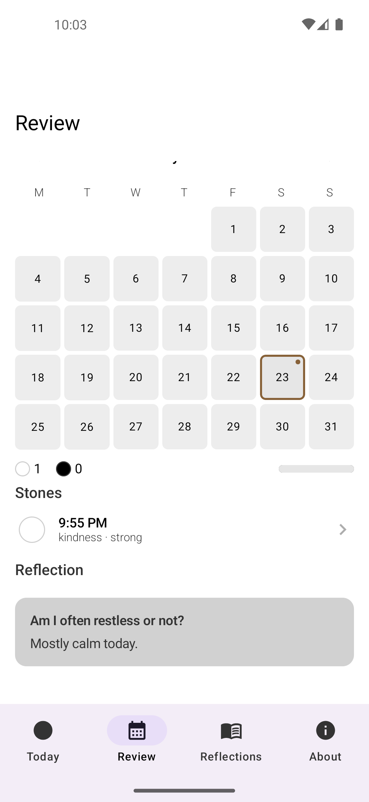

All-time month-over-month chart:

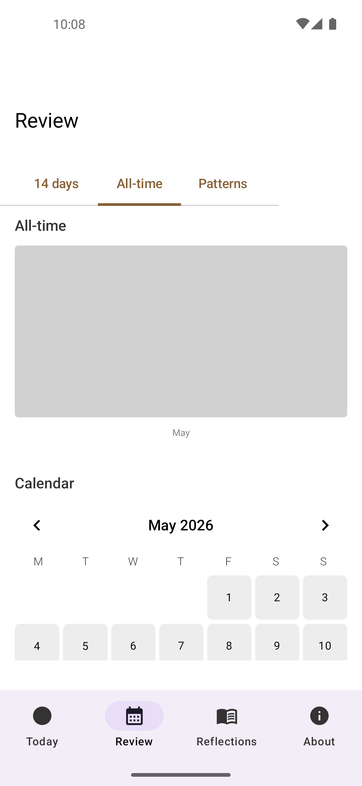

---

## 2. Stone tagging + schema migration (PR 2 — `1665eb4`)

### Data layer

- Room schema export enabled. Committed JSON schemas under `app/schemas/com.whitestone.app.data.StoneDatabase/1.json` and `2.json`.
- `StoneDatabase` bumped to version 2.
- Hand-written `MIGRATION_1_2` adds three nullable columns to the `stones` table:
  - `rootTagsCsv: String?` — comma-joined raw values
  - `rootDescriptor: String?` — newline-joined custom user descriptors
  - `intensity: String?` — `strong` or `weak`
- New `data/StoneTags.kt` introduces `StoneRoot` and `StoneIntensity` enums with iOS-compatible raw values (`sensual`, `illWill`, `harming`, `renunciation`, `kindness`, `harmlessness`; `strong`, `weak`) plus parsing/display helpers including `tagSummaryText` (`"kindness · strong"` style).

### UI

- `ui/addstone/AddStoneSheet.kt` extended with two new optional sections below the note field:
  - **Root (optional)** — multi-select chips scoped to current stone colour, with a `+ custom` affordance for free-text descriptors.
  - **Intensity (optional)** — single-select `Strong` / `Weak`.
- New shared component `ui/components/StoneTagEditor.kt`.
- `ui/stonedetail/StoneDetailScreen.kt` — same chip rows in edit mode, `tagSummaryText` rendered next to timestamp in read mode.
- `ui/components/StoneTimelineItem.kt` — renders `tagSummaryText` under the time/note row when present (visible in the Review screenshots above).

### Tests added

- `app/src/test/java/com/whitestone/app/data/StoneTagHelpersTest.kt`
- `app/src/test/java/com/whitestone/app/ui/stonedetail/StoneDetailViewModelTest.kt`
- `app/src/androidTest/java/com/whitestone/app/data/MigrationTest.kt` (v1 → v2)
- `app/src/androidTest/java/com/whitestone/app/data/StoneDaoTest.kt`

### Screenshots

Add Stone with the new Root chips (rendered for the current white-stone colour: `renunciation`, `kindness`, `harmlessness`), `+ custom`, and Intensity:

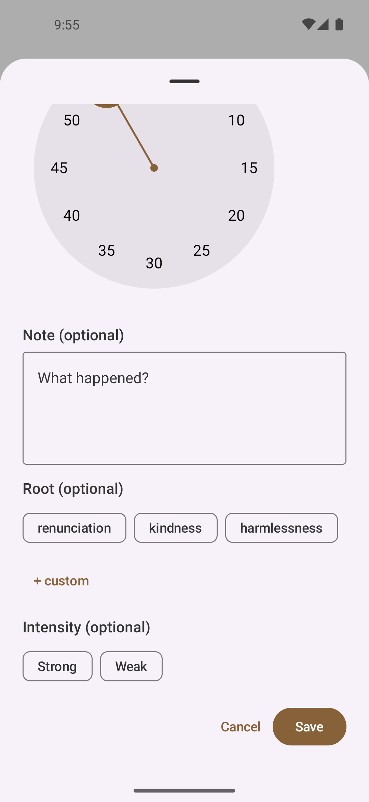

Selected state — `kindness` root + `Strong` intensity highlighted:

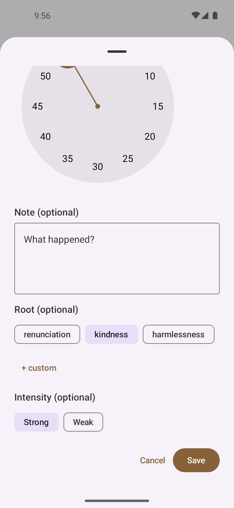

Resulting timeline entry shows the `kindness · strong` summary (see `13_review_calendar.png` above).

---

## 3. Reflections tab (PR 3 — `2607393`)

### Data layer

- `StoneDatabase` bumped to version 3.
- New entity `data/Reflection.kt` with unique index on `dayKey`.
- New `data/ReflectionDao.kt` exposing `getByDayKey`, `getAllForQuestion`, `countsByQuestion`, `upsert`, `deleteByDayKey`.
- Schema committed at `app/schemas/com.whitestone.app.data.StoneDatabase/3.json`.
- Hand-written `MIGRATION_2_3` creating the `reflections` table.

### Question rotation

- `util/ReflectionQuestions.kt` — 10-element question list (verbatim from iOS) with `questionForDate(date) = dayOfYear % 10`. Determinism verified against iOS by unit tests (`util/ReflectionQuestionsTest.kt`).

### UI

New `ui/reflection/` package replaces the placeholder stub:

- `ReflectionScreen.kt` — root with Daily (default) and By-question modes, toggled by a book icon top-right.
- `ReflectionViewModel.kt` — backs the screen with Room flows.
- Daily mode: today's date, today's question, free-text editor (placeholder `"Take your time. There's no need to write anything."`), single `Save` button with in-place save confirmation (`Saved at HH:MM PM.`).
- By-question mode: 10 collapsible sections, count per question, inline entries.
- Detail view: per-entry editable response with prev/next walking only across the same `questionIndex`.

### Cross-tab integration

- `ui/review/ReviewScreen.kt` — calendar day cells now render a small brown dot when a `Reflection` exists for that `dayKey`.
- Selected-day section in Review and `DayDetailScreen` append a quiet reflection card; tap opens the editable detail view.
- `ui/about/AboutScreen.kt` — adds a Reflections attribution line and a tappable SuttaCentral link (`Daily questions from Sacitta Sutta (AN 10.51)`).

### Tests added

- `util/ReflectionQuestionsTest.kt`
- `androidTest/data/ReflectionDaoTest.kt`
- `androidTest/data/MigrationTest.kt` (extended to cover v2 → v3)

### Screenshots

Reflections — Daily mode (empty editor placeholder):

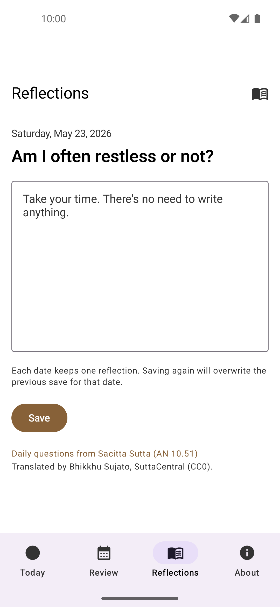

Typed entry and saved confirmation (`Saved at 10:01 PM.`):

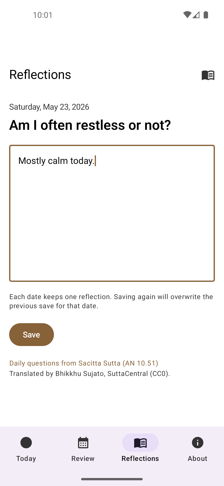

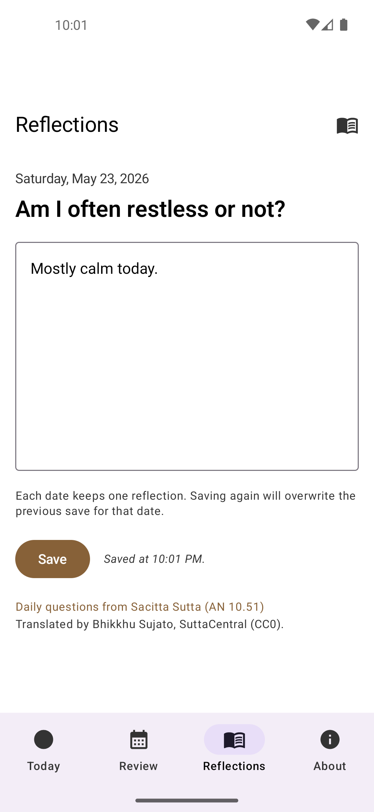

By-question mode showing per-question counts (`Am I often restless or not? — 1 reflection.`):

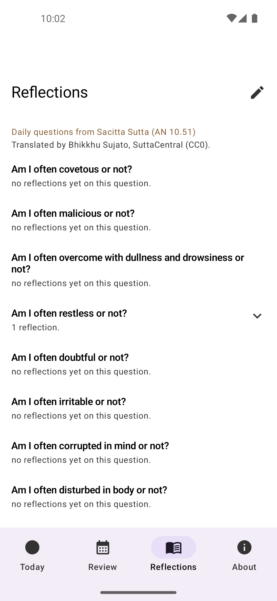

Saved reflection appears as a small brown dot on day 23 of the Review calendar and as a Reflection card in the selected-day section:

- Calendar dot — see `13_review_calendar.png` (top-right of the day 23 cell)
- Reflection card — see `14_review_day_reflection.png`

About screen with new attribution and clickable SuttaCentral link:

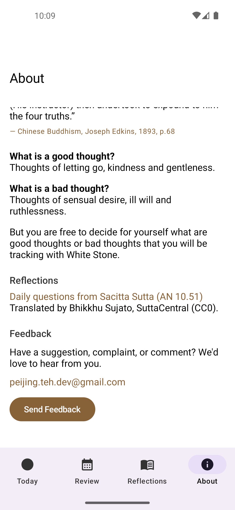

---

## 4. Pattern observations (PR 4 — `01deaad`)

- New `util/PatternEngine.kt` — pure function ported from iOS `PatternEngine.swift`.
- 5 observation rules with iOS thresholds verbatim, 4-hour time buckets `(6-10, 10-14, 14-18, 18-22, 22-6)`, 14-day window, capped at 4 observations.
- `ui/review/ReviewScreen.kt` — `Patterns` segment now renders observations (or the under-10-stones empty-state line).
- Tests: `util/PatternEngineTest.kt` covers all five categories' threshold edges, tie-breaks, and the four-observation cap.

### Screenshot

Patterns segment with only one stone logged — shows the canonical empty-state copy `"Patterns will appear here once you've logged a few weeks of stones."`:

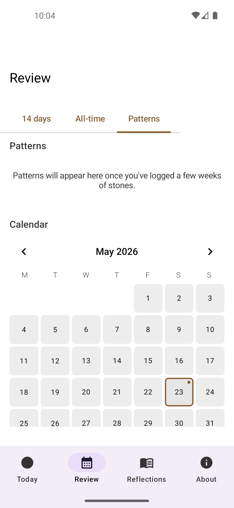

---

## 5. Onboarding parity flow (PR 5 — `9295c80`)

Brings Android back to parity with the updated iOS five-step onboarding sequence.

### Data layer

- New `data/OnboardingPreferences.kt` — `SharedPreferences`-backed state with `commit()` writes at critical transitions.
- `OnboardingStep` enum: `WELCOME`, `TODAY_COACH`, `FIRST_LOG`, `REVIEW_TOUR`, `REFLECTIONS_TOUR`, `COMPLETED`.

### UI

New `ui/onboarding/` package:

- `OnboardingCoordinator.kt` — bootstrap rules (no stones + no saved step → `WELCOME`, existing stones + no saved step → `COMPLETED`, completed never restarts).
- `OnboardingViewModel.kt` — exposes transitions including `continueToReflections()`.
- `WelcomeOnboardingSheet.kt` — `Track your thoughts, one stone at a time.` + `Start Tour` / `Skip`.
- `OnboardingCoachOverlay.kt` — two-step Today coach (`Swipe to switch stone`, `Hold to log this stone`).
- `FirstStoneSuccessSheet.kt` — `Nice Start` sheet with `Continue Tour` / `Finish Without Tour`.
- `ReviewTourOverlay.kt` — `Review` overlay with `Continue to Reflections` / `Skip Tour`.
- `ReflectionsTourOverlay.kt` (new) — `Reflections` overlay with `Finish Tour` / `Skip Tour`.

`ui/navigation/WhiteStoneNavGraph.kt` was rewired so each overlay only shows on its matching route, and `TodayViewModel` emits a one-shot save-success event so the first-stone sheet fires after a real insert.

### Tests added

- `app/src/test/java/com/whitestone/app/ui/onboarding/OnboardingCoordinatorTest.kt`
- `app/src/test/java/com/whitestone/app/ui/today/TodayViewModelTest.kt` (extended to cover save-success event)

### Screenshots (in flow order)

1. Welcome sheet:

   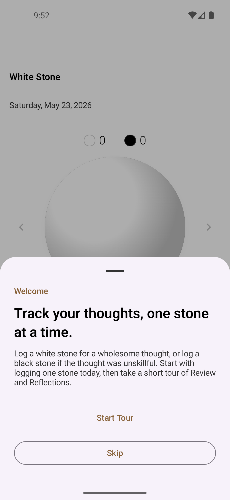

2. Today coach step 0 — Swipe to switch stone:

   

3. Today coach step 1 — Hold to log this stone:

   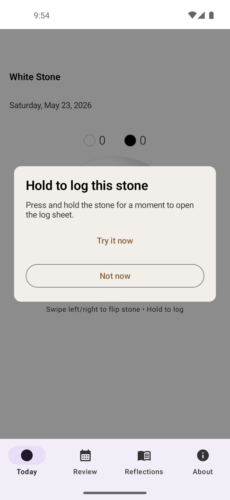

4. First stone success (`Nice Start`):

   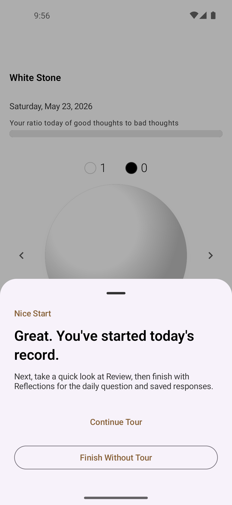

5. Review tour overlay:

   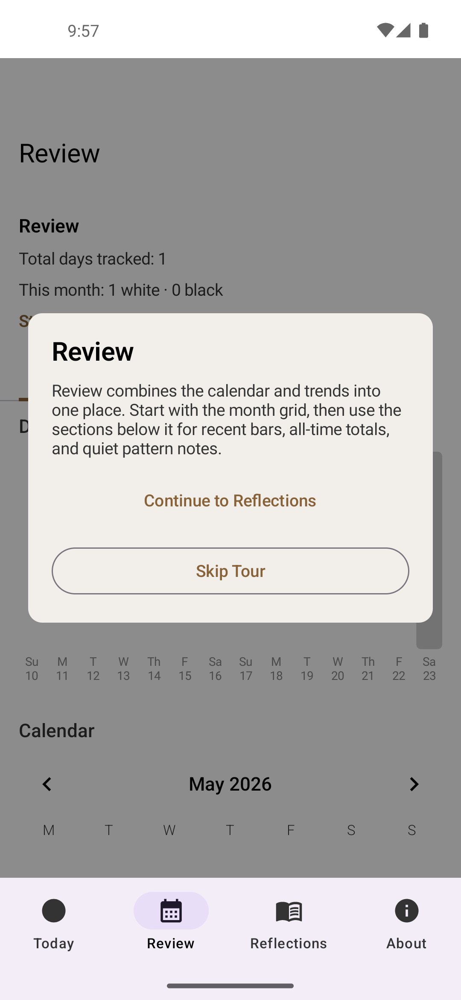

6. Reflections tour overlay (new step):

   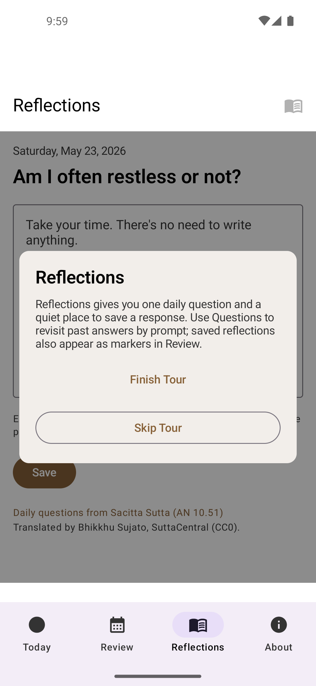

---

## Verification performed

The recent-work log in `CLAUDE.md` records the following gradle runs for the PRs above:

- `:app:assembleDebug`
- `:app:testDebugUnitTest`
- `:app:compileDebugAndroidTestKotlin`
- `:app:connectedDebugAndroidTest` on `Pixel_5_API_33`
- `:app:installDebug` and emulator launch / UI hierarchy verification

Screenshots in this document were captured against the installed debug build after clearing app data and walking through the full onboarding flow once.
